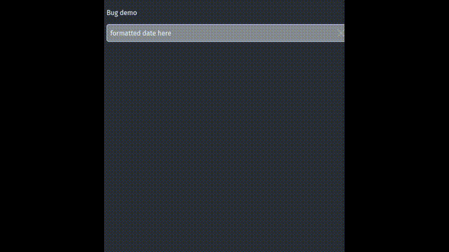

# Bug

This is a reproduction for a phoenix bug.

Bug: <https://github.com/phoenixframework/phoenix_live_view/issues/3971>

The click away phoenix even is dispatched when the clicked button is inside the
container but managed by a js library.

Just run:

* Run `mix setup` to install and setup dependencies
* Start Phoenix endpoint with `mix phx.server`

Now you can visit [`localhost:4000`](http://localhost:4000) from your browser.

## Video

